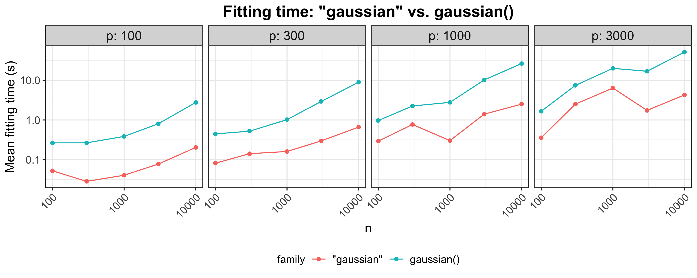
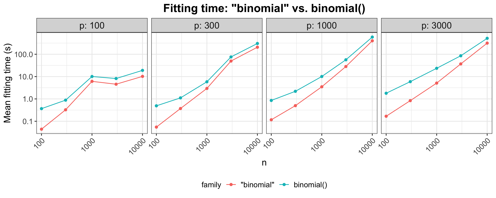

```{r, include = FALSE}
knitr::opts_chunk$set(
  collapse = TRUE,
  comment = "#>"
)
```

## Introduction

The `glmnet` package fits a generalized linear model (GLM) via
penalized maximum likelihood. Concretely, it solves the problem

$$ \min_{\beta_0, \beta} \frac{1}{N}\sum_{i=1}^N w_i l_i(y_i, \beta_0 + \beta^T x_i) + \lambda \left[\frac{1 - \alpha}{2}\|\beta\|_2^2 + \alpha \|\beta\|_1 \right] $$
over a grid of values of $\lambda$ covering the entire range. In the equation above, $l_i(y, \eta)$ is the negative log-likelihood contribution for observation $i$. $\alpha \in [0,1]$ is a tuning parameter which bridges the gap between the lasso ($\alpha = 1$, the default) and ridge regression ($\alpha = 0$), while $\lambda$ controls the overall strength of the penalty.

For `glmnet` v3.0-2 and below, `glmnet` could only solve the
minimization problem above for a limited number of built-in
(hardwired) families via its `family` argument. In particular,
`glmnet` could fit penalized Gaussian, binomial, and Poisson GLMs
(along with a few other special cases such as the Cox model,
multinomial regression, and multi-response Gaussian). In v4.0 onwards,
`glmnet` allows the user to fit a penalized regression model for *any*
GLM by allowing for any legitimate GLM family object, as used by the
`stats:glm` function.

### Additional families

Before v4.0, `glmnet`'s `family` argument had to be one of a limited
set of strings: `c("gaussian", "binomial", "poisson", "multinomial",
"cox", "mgaussian")`. This specified which of the *built-in* families
was to be used.  From v4.0 onwards, in addition to these 
strings, the `family argument to  `glmnet` can also be the  result of a call
to a `family` function. (To learn more about family functions in R,
run `?family` in the R console.)

All the functionality of `glmnet` applies to these new families, and
hence their addition expands the scope of `glmnet` considerably. In
particular,

* All the methods work as before, such as `plot`, `predict` etc.
* large and sparse `X` matrices as input ;
* upper and lower bound constraints on parameters;
* `cv.glmnet` for selecting the tuning parameters;
* `relax=TRUE` for fitting the unpenalized models to the
  active sets;
* `offsets` can be provided;
* penalty strengths, standardization, and other options.

### More on GLM families

A GLM is linear model for a response variable whose conditional
distribution belongs to a one-dimensional exponential family. Apart
from Gaussian, Poisson and binomial, there are other interesting
members of this family. Some examples are Gamma, inverse Gaussian,
negative binomial, to name a few. A GLM consists of 3 parts:

1. A linear predictor: $\eta_i = \sum_{j=1}^p \beta^T x_i$,
2. A link function: $\eta_i = g(\mu_i)$, and
3. A random component: $y_i \sim f(y \mid \mu_i)$.

The user gets to specify the link function $g$ and the family of
response distributions $f(\cdot \mid \mu)$, and fitting a GLM  amounts
to estimating the parameter $\beta$ by maximum likelihood.

In R, these 3 parts of the GLM are encapsulated in an object of class
`family` (run `?family` in the R console for more details). A `family`
object is a list of GLM components which allows functions such as
`stats:glm` to fit GLMs in R. As an example, the code below shows the
constituent parts for the binomial GLM, which is what is used to fit
linear logistic regression:
```{r}
fam <- binomial()
class(fam)
names(fam)
```
This is a list of functions and expressions that get used in the
*iteratively reweighted least squares* algorithm for fitting the GLM.

From v4.0 onwards, `glmnet` can fit penalized GLMs for any family as
long as the family can be expressed as a `family` object. In fact,
users can make their own families, or customize existing families,
just as they can for regular GLMs.

Generally this option should be used if the desired family is not
included in the built-in list. The reason is that the entire path
algorithm for the built-in families is implemented in Fortran, and so
will be faster.

## Fitting Gaussian, binomial and Poisson GLMs

First we demonstrate how we can use this new version of `glmnet` to fit ordinary least squares with the elastic net penalty. We set up some fake data:
```{r}
set.seed(1)
x <- matrix(rnorm(500), ncol = 5)
y <- rowSums(x[, 1:2]) + rnorm(100)
```

The function calls below demonstrate how we would fit the model with
the old and new `family` parameter options. To fit a linear regression
by least squares, we want to use the Gaussian family. There is a
*hard-wired* option for this, specified via `family="gaussian"` (which
is also the defaults for `glmnet`). Now we  can also use `family = gaussian()` to fit the same model.
```{r message = FALSE}
library(glmnet)
oldfit <- glmnet(x, y, family = "gaussian")
newfit <- glmnet(x, y, family = gaussian())
```

`glmnet` distinguishes these two cases because the first is a
character string, while the second is a GLM family object. 
Of course if we really wanted to fit this model, we would use the
hard-wired version, because it is faster. Here we want to show that
they are equivalent, up to machine precision.

There are slight differences in the algorithms used to compute the solutions, so some of the equality tests run using `testthat::expect_equal` might fail. However, these same tests can be made to pass by decreasing the `thresh` option in both function calls:

```{r}
thresh <- 1e-18
oldfit <- glmnet(x, y, family="gaussian", thresh = thresh)
newfit <- glmnet(x, y, family = gaussian(), thresh = thresh)

# tests for equality
library(testthat)
for (key in c("a0", "beta", "df", "dim", "lambda", "dev.ratio", 
              "nulldev", "offset", "nobs")) {
  expect_equal(oldfit[[key]], newfit[[key]])
}
```

Next, we demonstrate the function calls for the binomial and Poisson
GLM families. 

```{r}
biny <- ifelse(y > 0, 1, 0)  # binary data
cnty <- ceiling(exp(y))      # count data

# fitting binomial GLMs the old and new way
oldfit <- glmnet(x, biny, family = "binomial")
newfit <- glmnet(x, biny, family = binomial())

# fitting Poisson GLMs the old and new way
oldfit <- glmnet(x, cnty, family = "poisson")
newfit <- glmnet(x, cnty, family = poisson())
```

### Timing comparisons

In the examples above, the new version is simply replicating existing
functionality in `glmnet`. For these GLMs, we recommend specifying the
GLM family as a string for computational efficiency. The Figures 1-2
illustrate that existing code for these GLM families is  more
efficient than the new code, especially for the Gaussian case.

 For the new families, the model is fit for each value
of `lambda` by a "proximal Newton" algorithm, with the outer loops
coded in R. The inner loop is fit by a weighted elastic-net algorithm,
which is implemented in Fortran. However, the R code also exploits
warm starts as it iterates down the path, so is reasonably efficient.

(In the figures, `n` and `p` denote the number of observations and features respectively. Each point is the mean of 5 simulation runs. Note that both the `x` and `y` axes are on a log scale.)

{width=90%}

{width=90%}

## Fitting other GLMs

The real power of the new code is in fitting GLMs other than the three
in the previous section, by passing a GLM `"family"` object as the
`family` argument to `glmnet`. 

 <!-- (This is subset of the functionality that `stats:glm`'s `family` option has.) -->


For example, performing probit regression with the elastic net penalty is as simple as the code below:
```{r}
newfit <- glmnet(x, biny, family = binomial(link = "probit"))
```
For the *complementary log-log* link we would specify `family = binomial(link = "cloglog")`

We can fit nonlinear least-squares models by using a different link
with the Gaussian family; for example  `family=gaussian(link="log")`.

For count data, we can fit a quasi-Poisson model that allows for overdispersion:
```{r}
newfit <- glmnet(x, cnty, family = quasipoisson())
```

Performing negative binomial regression (instead of Poisson regression) is also easy:
```{r, eval=FALSE}
library(MASS)
newfit <- glmnet(x, cnty, family = negative.binomial(theta = 5))
```

There are many other families, including `quasi` where users can
customize their own families. In addition, there are additional
specialized 
families, such as `statmod:tweedie` for overdispersed count data, for example.

## `glmnetfit` class

If `glmnet` is called with GLM `family`  object as its argument, it
returns an object with class:
```{r}
class(newfit)
```
This is similar to the hard-wired classes; for example a
`family="gaussian"` has class 
```{r}
fit=glmnet(x,y,family="gaussian")
class(fit)
```

Importantly, both these inherit from class `"glmnet"`, and so all the S3
methods such as `plot`, `predict`, `coef`, and `print` will work out
the box.

## Step size halving within iteratively reweighted least squares (IRLS)

Before v4.0, `glmnet` solved the optimization problem for non-Gaussian families via iteratively reweighted least squares (IRLS). In each iteration a unit Newton step was taken, and the algorithm terminated when the unit Newton step did not decrease the deviance sufficiently. Because the algorithm was forced to take a unit step, this could result in non-convergence of the algorithm in some cases.

Here is an example of the non-convergence for Poisson data. The `stats:glm` function converges and gives us coefficients that are reasonably close to the truth:
```{r}
set.seed(2020)
n <- 100
p <- 4
x <- matrix(runif(n*p, 5, 10), n)
y <- rpois(n, exp(rowMeans(x)))

# glm fit
glmfit <- glm(y ~ x-1, family = poisson)
coef(glmfit)
```

Fitting `glmnet` with `lambda = 0` is equivalent to fitting a GLM. If we use `glmnet` version before v4.0, we encounter an issue with non-convergence:
```{r}
oldfit <- glmnet(x, y, family = "poisson", standardize = FALSE, intercept = FALSE,
                 lambda = 0)
coef(oldfit)
```

This divergence happens because the unit Newton step was too large. To address this issue, from v4.0 onwards if a `family` object is passed to the `family` argument of `glmnet`, the IRLS algorithm will perform step size halving. After computing the Newton step, the algorithm checks if the new solution has infinite (or astronomically large) objective function value or if it results in invalid $\eta$ or $\mu$. If so, the algorithm halves the step size repeatedly until these invalid conditions no longer hold.

The code below shows that this step size halving avoids the divergence we were experiencing in our running example:
```{r}
glmnet.control(mxitnr = 50)  # increase maximum no. of IRLS iterations allowed
newfit <- glmnet(x, y, family = poisson(), standardize = FALSE, intercept = FALSE,
                 lambda = 0)
coef(newfit)
```

In the process, `glmnet` warns the user that an infinite objective function value was encountered and that step size halving was done to address the issue. The coefficients are close to those obtained by `stats:glm`, and can be made to be numerically indistinguishable by tightening the convergence criterion in both function calls.
```{r}
thresh <- 1e-15
glmfit <- glm(y ~ x-1, family = poisson,
              control = list(epsilon = thresh, maxit = 100))
newfit <- glmnet(x, y, family = poisson(), standardize = FALSE, intercept = FALSE,
                 lambda = 0, thresh = thresh)

# coef(glmfit) doesn't have intercept but coef(newfit does)
expect_equal(as.numeric(coef(glmfit)), 
             as.numeric(coef(newfit))[2:5])
```


## Appendix 1: Internal parameters

With this generalization of `glmnet`, we have added two new internal parameters which control some aspects of the model computation. The factory default settings are expected to work in most cases and users do not need to make changes unless there are special requirements.

These two parameters are related to the iteratively reweighted least squares (IRLS) loop for solving the optimization problem at each value of $\lambda$:

- `epsnr`: convergence threshold for the IRLS loop; factory default = 1e-08
- `mxitnr`: maximum iterations for the IRLS loop for each value of $\lambda$; factory default = 25

As with other internal parameters, `epsnr` and `mxitnr` can be changed by calling `glmnet.control`. For example, if we wanted to increase the maximum number of iterations allowed for the IRLS loop for each $\lambda$, we would run
```{r}
glmnet.control(mxitnr = 50)
```

Any changes made to these internal parameters will hold for the duration of the R session unless they are changed by the user with a subsequent call to `glmnet.control`. To restore the factory defaults, run
```{r}
glmnet.control(factory = TRUE)
```
